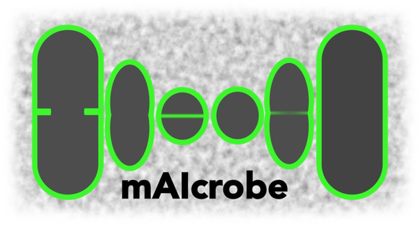

[](https://github.com/HenriquesLab/mAIcrobe/raw/main/LICENSE)
[](https://pypi.org/project/napari-mAIcrobe)
[](https://python.org)
[](https://github.com/HenriquesLab/mAIcrobe/actions/workflows/test_oncall.yml)
[](https://napari-hub.org/plugins/napari-mAIcrobe)
[](https://maicrobe.henriqueslab.org)
[](https://www.biorxiv.org/content/10.1101/2025.10.21.683709v2)

# mAIcrobe



**mAIcrobe: a napari plugin for microbial image analysis.**

mAIcrobe is a comprehensive napari plugin that facilitates image analysis workflows of bacterial cells. Combining state-of-the-art segmentation approaches, morphological analysis and adaptable classification models into a napari-plugin, mAIcrobe aims to deliver a user-friendly interface that helps inexperienced users perform image analysis tasks regardless of the bacterial species and microscopy modality. Built using Python 3.10 and 3.11 and tested on Windows, and macOS.

**You can read more about mAIcrobe in our [preprint](https://www.biorxiv.org/content/10.1101/2025.10.21.683709v2).**

## Video Showcase

[](https://youtu.be/UQ-dgATCgkU)

## ✨ Why mAIcrobe?

### 🔬 **For Microbiologists**
- **Automated Cell Segmentation**: StarDist2D, Cellpose, and custom U-Net models. Several pre-trained models also included.
- **Deep learning classification**: 6 pre-trained CNN models for *S. aureus* cell cycle determination, a pre-trained model for *E. coli* antibiotic phenotyping plus support for custom models.
- **Morphological Analysis**: Comprehensive measurements using scikit-image regionprops
- **Interactive Filtering**: Real-time cell selection based on computed statistics

### 📊 **For Quantitative Research**
- **Colocalization Analysis**: Multi-channel fluorescence quantification
- **Timelapse Analysis**: 2D+t workflows with optional registration and label reassignment
- **Batch Processing**: Analyze one folder containing multiple FoVs with merged outputs
- **Automated Reports**: HTML reports with visualizations and statistics
- **Data Export**: CSV export for downstream statistical analysis


## 🚀 Installation

**Standard Installation:**

We recommend using an environment manager like [conda](https://docs.conda.io/en/latest/) to handle dependencies and assure reproducibility.

Regardless of environment, you can install via pip in Python 3.10 or 3.11. This should handle all dependencies and might take a couple of minutes depending on your internet connection.

```bash
pip install napari-mAIcrobe
```

**Development Installation:**

```bash
git clone https://github.com/HenriquesLab/mAIcrobe.git
cd mAIcrobe
pip install -e .
```

**🎯 [Detailed Installation Instructions →](docs/user-guide/getting-started.md#-installation)**

## 🏆 Key Features

### 🎨 **Cell Segmentation**
- **Thresholding**: Isodata and Local Average methods with watershed
- **StarDist2D**: custom models (pretrained available for *S. aureus*)
- **Cellpose**: cyto3 model
- **Custom U-Net Models**: custom models (pretrained available for *S. aureus*, *B. subtilis*, and *S. pneumoniae*)

### 🧠 **Single cell Classification**
- **Pre-trained Models**: *S. aureus* cell cycle and *E. coli* antibiotic phenotyping
- **Custom Model Support**: Build your training dataset in napari with out custom [widget](docs/tutorials/generate_trainingdata.md), train using our jupyter notebook and load your own TensorFlow models,

### 📊 **Comprehensive Morphometry**
- **Shape Analysis**: Area, perimeter, eccentricity
- **Intensity Measurements**: Fluorescence statistics
- **Custom Measurements**: Septum detection, colocalization, and more

## 📖 Documentation

| Guide | Purpose |
|-------|---------|
| **[🚀 Getting Started](docs/user-guide/getting-started.md)** | Installation to first analysis using sample data|
| **[🔬 Segmentation Guide](docs/user-guide/segmentation-guide.md)** | Explore the available segmentation methods|
| **[📊 Cell Analysis](docs/user-guide/cell-analysis.md)** | Explore complete analysis workflow and check the metrics measured |
| **[🧠 Cell Classification Guide](docs/user-guide/cell-classification.md)** | Explore the available classification models |
| **[⏱️ Timelapse Analysis](docs/user-guide/timelapse-analysis.md)** | Analyze `(T, Y, X)` data with optional registration and relabeling |
| **[📁 Batch Analysis Workflow](docs/user-guide/batch-analysis-workflow.md)** | Process many FoVs from one root folder and export merged tables |

| Tutorial | Purpose |
|-------|---------|
| **[🎨 Basic Workflow](docs/tutorials/basic-workflow.md)** | Step-by-step guide with a simple example (<5 minutes)|
| **[🛠️ Generate Training Data](docs/tutorials/generate_trainingdata.md)** | Create annotated datasets for custom model training |


| Video | Purpose |
|-------|---------|
| **[🎨 Basic Workflow](https://youtu.be/UQ-dgATCgkU)** | Step-by-step guide with a simple example (<5 minutes)|
| **[🛠️ Full workflow](https://youtu.be/szYAi0zSKSA)** | Full workflow from installation to export of results |
| **[🧠 How to retrain the classifier ](https://youtu.be/fO3XxTM3xk8)** | Create annotated datasets, train your custom model and use it in mAIcrobe |


**For programmatic usage:**
| **[⚙️ API Reference](docs/api/api-reference.md)**


## 📚 Available Jupyter Notebooks

Explore advanced functionality with included notebooks:

- **[Cell Cycle Model Training](notebooks/napari_mAIcrobe_cellcyclemodel.ipynb)**: To train custom classification models
- **[StarDist Segmentation](notebooks/StarDistSegmentationTraining.ipynb)**: To retrain a StarDist segmentation model

## 🤝 Community

- **🐛 [Issues](https://github.com/HenriquesLab/mAIcrobe/issues)** - Report bugs, request features
- **📚 [napari hub](https://napari-hub.org/plugins/napari-mAIcrobe)** - Plugin ecosystem

## 🏗️ Contributing

We welcome contributions! Whether it's:

- 🐛 Bug reports and fixes
- ✨ New segmentation algorithms
- 📖 Documentation improvements
- 🧪 Additional test datasets
- 🤖 New AI models for classification

**Quick contributor setup:**
```bash
git clone https://github.com/HenriquesLab/mAIcrobe.git
cd mAIcrobe
pip install -e .[testing]
pre-commit install
```

**Testing:**
```bash
# Run tests
pytest -v

# Run tests with coverage
pytest --cov=napari_mAIcrobe

# Run tests across Python versions
tox
```

**[📋 Full Contributing Guide →](CONTRIBUTING.md)**


## 📜 License

Distributed under the terms of the [BSD-3](http://opensource.org/licenses/BSD-3-Clause) license, mAIcrobe is free and open source software.

## 🙏 Acknowledgments

mAIcrobe is developed in the [Henriques](https://henriqueslab.org) and [Pinho](https://www.itqb.unl.pt/research/biology/bacterial-cell-biology) Labs with contributions from the napari and scientific Python communities.

**Built with:**
- [napari](https://napari.org/) - Multi-dimensional image viewer
- [TensorFlow](https://tensorflow.org/) - Machine learning framework
- [StarDist](https://github.com/stardist/stardist) - Object detection with star-convex shapes
- [Cellpose](https://github.com/MouseLand/cellpose) - Generalist cell segmentation
- [scikit-image](https://scikit-image.org/) - Image processing library

---

<div align="center">

**🔬 From the [Henriques](https://henriqueslab.org) and [Pinho](https://www.itqb.unl.pt/research/biology/bacterial-cell-biology) Labs**

*"Advancing microbiology through AI-powered image analysis."*

**[🚀 Get Started →](docs/user-guide/getting-started.md)** | **[⏱️ Timelapse Guide →](docs/user-guide/timelapse-analysis.md)** | **[📁 Batch Workflow →](docs/user-guide/batch-analysis-workflow.md)** | **[⚙️ API Docs →](docs/api/api-reference.md)**

</div>
