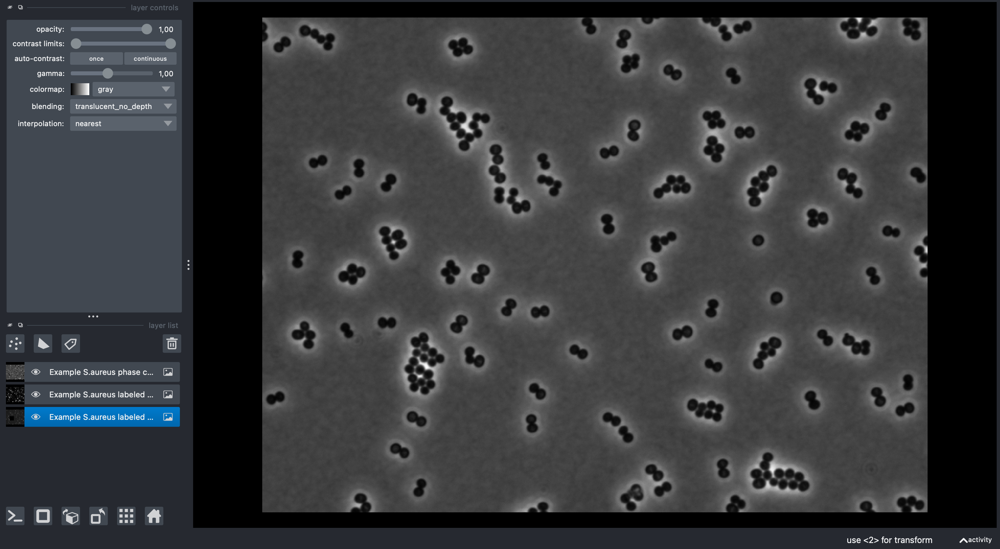
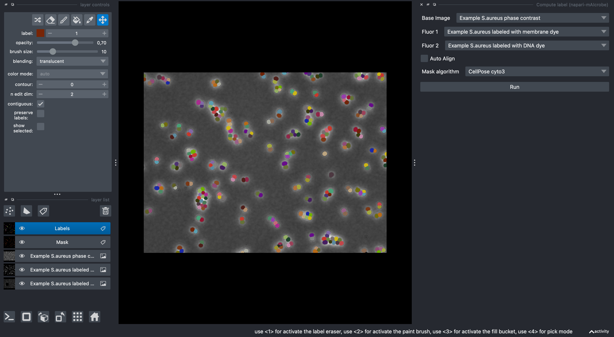
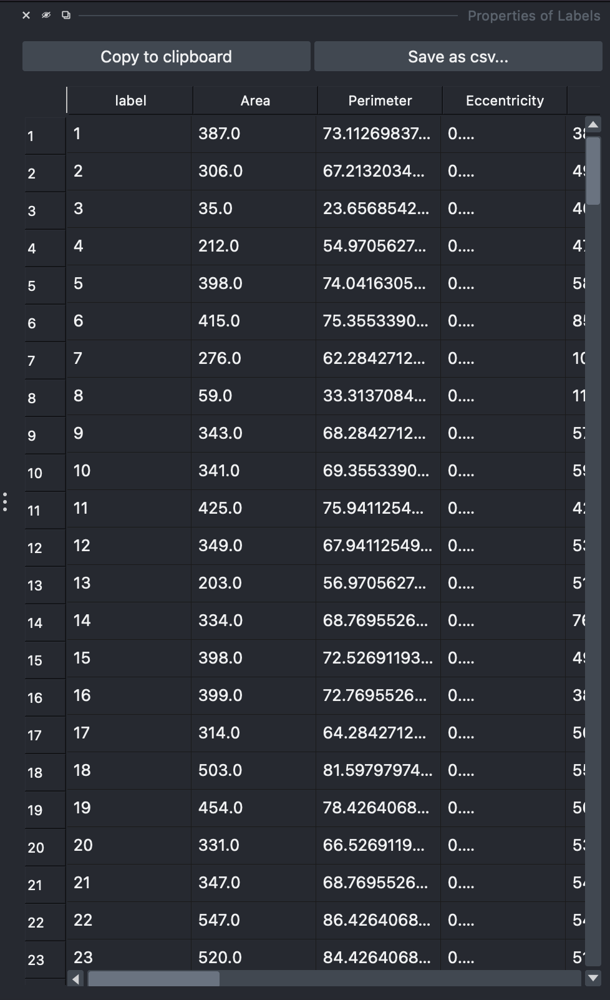

# Basic Workflow Tutorial

This step-by-step tutorial will guide you through a complete bacterial cell analysis workflow using napari-mAIcrobe, from image loading to final report generation.

## 🎯 Tutorial Goals

By the end of this tutorial, you will:
- 🖼️ Load and display bacterial images
- 🔬 Segment individual cells using Isodata thresholding or CellPose cyto3 model
- 📏 Perform morphological analysis
- 🧠 Perform cell cycle classification
- 📊 Generate a report

## 📊 Dataset Overview

We'll use the included _S. aureus_ sample data featuring:
- **📸 Phase contrast**: Cell morphology and boundaries
- **🔴 Membrane fluorescence**: NileRed staining of cell membranes
- **🧬 DNA fluorescence**: Hoechst staining of DNA (note that there is a black square in the image. It is on purpose to show how to filter cells without DNA signal!)

---

## 🚀 Step-by-Step Workflow

### Step 1: Launch napari and Load Data

First, let's start napari and load the sample data:

#### 🖥️ GUI Method

Go to your terminal and run:
```bash
napari
```

In the napari GUI, load the sample images via:
`File > Open Sample > mAIcrobe > (...)`

#### 💻 Programmatic Method

Alternatively, you can load the images programmatically:

```python
import napari
import numpy as np

# Launch napari viewer
viewer = napari.Viewer()

# Load sample data
from napari_mAIcrobe._sample_data import phase_example, membrane_example, dna_example

# Get the sample images
phase_data = phase_example()[0]
membrane_data = membrane_example()[0]
dna_data = dna_example()[0]

# Add images to viewer
phase_layer = viewer.add_image(phase_data[0], **phase_data[1])
membrane_layer = viewer.add_image(membrane_data[0], **membrane_data[1])
dna_layer = viewer.add_image(dna_data[0], **dna_data[1])
```

**✅ Expected result:** You should see three image layers in napari with bacterial cells visible in each channel.



---

### Step 2: Cell Segmentation

Now we'll segment individual cells using the Compute label widget:

#### ⚙️ Configuration

1. **Access the widget:**
   - Go to `Plugins > mAIcrobe > Compute label`

2. **Configure segmentation parameters:**
   ```
   Base Image: Phase (select the phase contrast layer)
   Fluor 1: Membrane (select the membrane layer)
   Fluor 2: DNA (select the DNA layer)
   Model: Isodata (or CellPose cyto3)
   ```
   The GUI should automatically change the available parameter options based on the selected model. For the purpose of this tutorial, independent of the selected model, leave all other parameters as default.

3. **Run segmentation:**
   - Click the **Run** button
   - Wait for processing to complete (typically 5-10 seconds, could be longer for large images or if its the first time you are running CellPose as it needs to download the model into cache)

**✅ Expected result:** Two new layers appear. A "Mask" layer and a "Labels" layer appears with individual cells outlined in different colors.



#### 🔍 Evaluating Segmentation Quality

**✅ Good segmentation indicators:**
- Each bacterial cell has a unique label/color
- Cell boundaries align well with phase contrast edges
- Minimal over-segmentation (cells split incorrectly)
- Minimal under-segmentation (cells merged incorrectly)

**⚠️ If segmentation needs improvement:**
- Try a different model
- Adjust parameters (e.g., Fill holes)

---

### Step 3: Comprehensive Cell Analysis

With segmented cells, we can now perform detailed analysis:

#### ⚙️ Configuration

1. **Open the analysis widget:**
   - Go to `Plugins > mAIcrobe > Compute cells`

2. **Configure analysis parameters:**
   ```
   Label Image: Labels (from segmentation step)
   Membrane Image: Membrane
   DNA Image: DNA
   Classify cell cycle: ✓ (enable AI classification)
   Model: S.aureus DNA+Membrane Epi
   Generate Report: ✓ (create HTML report)
   Report path: [choose output directory]
   ```

   For the purpose of this tutorial, leave all other parameters as default.

3. **Run analysis:**
   - Click **Run**
   - Analysis may take 5-20 seconds depending on cell count

**✅ Expected result:** The Labels layer now contains comprehensive measurements for each cell, including morphology, intensity, and cell cycle predictions as layer properties. A HTML report is generated in the specified directory. A table appears on the napari GUI.



---

### Step 4: Explore Analysis Results

#### 📊 View Cell Statistics

1. **Access the properties panel:**
   - Select the Labels layer
   - On the properties panel to the right, double right click on a header. A new layer appears color coded by the selected property.

2. **Available measurements:**
   - **📏 Morphology:** area, perimeter, eccentricity
   - **💡 Intensity:** Baseline, and median intensity for the cell, membrane, cytoplasm and septum (if find septum is enabled). Fluorescent ratios betweens septa and membrane are also available if find septum is enabled.
   - **🧠 Cell cycle:** predicted phase
   - **🧬 DNA:** relative DNA content when compared to the baseline background fluorescence (DNARatio)

#### 🔍 Interactive Data Exploration

You can interactively explore and filter cells based on measurements:

**🎛️ GUI Filtering:**
1. **Open the filtering widget:**
   - Go to `Plugins > mAIcrobe > Filter cells`
2. **Set filtering criteria:**
   - Select the Labels layer
   - Click the "+" button to add filters
   - Choose properties to filter (e.g., Area, Eccentricity, Cell cycle phase)
   - Adjust min/max sliders to refine selection
3. **Apply filters:**
   - Filters are automatically applied on a new layer called "Filtered cells".
   - Hide the original Labels layer to see only filtered results.

**💻 Programmatic Exploration:**

```python
# Access the analysis results programmatically
labels_layer = viewer.layers['Labels']
properties = labels_layer.properties

# View available measurements
print("Available properties:", properties.keys())

# Examine cell cycle distribution
cell_phases = properties['Cell Cycle Phase']
unique_phases, counts = np.unique(cell_phases, return_counts=True)
print("Cell cycle distribution:")
for phase, count in zip(unique_phases, counts):
    print(f"  {phase}: {count} cells")

# Basic statistics
areas = properties['Area']
print(f"Average cell area: {np.mean(areas):.2f} ± {np.std(areas):.2f} px")
```

---

### Step 5: Generate and Review Report

If you enabled report generation, examine the HTML output:

**📁 Report contents:**
- **📄 HTML report** Total cells their properties and a small crop of each cell
- **📊 .csv file:** All cell properties in tabular format

---

### 🥒 Optional: Export Training Data for Custom Classifiers

You can create pickle files with per-cell crops for training your own models:

#### 🛠️ Workflow:

1. **📌 Manually annotate cells using a Points layer:**
   - Create a Points layer and name it with a positive integer (class id), e.g., "1"
   - Add one point per cell to assign to that class
   - Repeat for other classes with different integer names
   - Make sure you have a Labels layer to detect individual cells and one or two Image layers to extract the training crops from.
   - Check the oficial napari documentation on how to create and edit Points layers if needed - [here](https://napari.org/dev/howtos/layers/points.html).

2. **💾 Export pickles:**
   - Go to `Plugins > mAIcrobe > Compute pickles`
   - Select:
     - Labels layer
     - Points layer named with a positive integer (class id), one point per cell
     - Channel 1 (required) and optionally Channel 2
     - Output directory
   - Click "Save Pickle"

#### 📁 Outputs:
- `Class_<id>_source.p` with crops (100×100 single-channel or 100×200 concatenated)
- `Class_<id>_target.p` with class ids

These files can be used in your training pipelines or the provided notebooks. They are designed for seamless integration with the [Cell Cycle Model Training](../../notebooks/napari_mAIcrobe_cellcyclemodel.ipynb) notebook.

---

## 🎉 Congratulations!

Congratulations on completing your first napari-mAIcrobe analysis! 🎉

### 🚀 Next Steps:
- **[Cell Analysis Guide](../user-guide/cell-analysis.md)** - Detailed analysis options
- **[Cell Classification Guide](../user-guide/cell-classification.md)** - Deep learning classification
- **[Segmentation Guide](../user-guide/segmentation-guide.md)** - Advanced segmentation methods
- **[API Reference](../api/api-reference.md)** - Programmatic control
