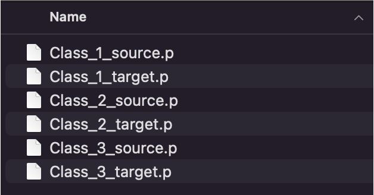

# Generate Training Data for Cell Classification

Create high‑quality training datasets from your annotated images using the Compute pickles widget. This tutorial walks you through the full process, from preparing layers to exporting standardized crops and targets ready for model training.

---

## ✨ What You’ll Build

You will export:
- Class_\<id>_source.p — list of per‑cell crops (100×100 if training with 1 channel, 100×200 if training with 2 channels)
- Class_\<id>_target.p — list of class ids (same length as source)

The \<id> corresponds to the class you will assign to each cell (e.g., "1", "2", "3").
These files are made to plug directly into the training notebook: [Cell Cycle Model Training](../../notebooks/napari_mAIcrobe_cellcyclemodel.ipynb).

<div align="center">
    
</div>


---

## ✅ Prerequisites

See [Getting Started](../user-guide/getting_started.md) for installation and sample data.
The [Basic workflow](basic-workflow.md) and [Segmentation Guide](../user-guide/segmentation-guide.md) are also helpful.

You will need:

- napari and napari-mAIcrobe installed (see [Getting Started](../user-guide/getting_started.md))
- A Labels layer with segmented cells (e.g., from Compute label, see [Segmentation Guide](../user-guide/segmentation-guide.md))
- One or two Image layers (e.g., DNA, Membrane, Phase) -> these are the channels actually used for classification

---

## 🧭 Workflow Overview

1) Prepare layers: Images, Labels, and Points per class
2) Open Plugins > mAIcrobe > Compute pickles
3) Select labels, points, channels, and output folder
4) Click Save Pickle
5) Repeat for each class


---

## 🧰 Step-by-Step

### 1) Launch napari and load your data
- Launch napari (e.g., `napari` in terminal)
- Load your images and labels into napari (e.g. drag and drop files into the viewer).


---

### 2) Segment cells (if needed)
If you don’t have segmentation we can use napari-mAIcrobe to generate Labels layer:
- Go to Plugins > mAIcrobe > Compute label
- Set Base Image, (optionally) Fluor channels and other parameters.
- Choose a segmentation model (e.g., Isodata or CellPose cyto3)
- Click Run

Tips:
- Check the [Segmentation Guide](../user-guide/segmentation-guide.md) for the available ways to segment your images.
- You can always refine the segmentation manually using napari’s built-in label editing tools.
- Check the official napari [Labels layer documentation](https://napari.org/dev/howtos/layers/labels.html) for more details on using Labels layers.


---

### 3) Create a Points layer per class and annotate cells
- Create a Points layer for each class you want to define and rename them (double click its name) to a positive integer that corresponds to its class id (e.g., “1”, “2”, “3”).
- Select the points layer corresponding to the class you want to annotate
- Click the “Add points” button in the layer controls
- Add exactly one point inside each labeled cell that belongs to this class
- Repeat by creating new Points layers for other classes (e.g., “2”, “3”)

<div align="center">
    
</div>

Tips:
- Check the official napari [Points layer documentation](https://napari.org/dev/howtos/layers/points.html) for more details on using Points layers.
- One point per cell and one class per cell; do not add multiple points to the same label or assign multiple classes to the same cell
- Place points well inside the cell region to avoid ambiguity
- To facilitate visualization, you can hide superfluous layers or change the opacity of the Label layer while annotating.


---

### 4) Open the Compute pickles widget
- Go to Plugins > mAIcrobe > Compute pickles

<div align="center">
    
</div>

---

### 5) Configure the export
- Labels layer: Select your Labels layer
- Points layer: Select one class Points layer (e.g., “1”)
- Number of channels:
  - One Channel → choose Channel 1 (e.g., Membrane or DNA)
  - Two Channels → choose Channel 1 and Channel 2 (e.g., Membrane + DNA)
- Path to save pickles: Choose an empty or dedicated folder
- Click Save Pickle

**What happens under the hood:**
- Finds the label under each point
- Crops the cell with a small margin (default 5 px)
- Masks the crop by the cell shape defined by the label
- Pads the crop with zero to a square, resizes to 100×100
- If two channels, concatenates side‑by‑side into 100×200
- Rescales intensities to [0, 1]
- Saves Class_<id>_source.p and Class_<id>_target.p


---

### 6) Repeat for all classes
- Switch the selected layer to the Points layer to the next class id (e.g., “2”) and Save Pickle again
- Repeat until all classes are exported

Tips:
- Hide the Points layers of classes you have already exported to avoid confusion

---

## 📦 Understanding the Outputs

- Class_<id>_source.p: list of NumPy arrays
  - One channel → arrays shaped (100, 100)
  - Two channels → arrays shaped (100, 200) with channels concatenated horizontally
- Class_<id>_target.p: list of integers equal to the class id (same length as source)

Quick check:

```python
import pickle, os
path = "/path/to/output"

with open(os.path.join(path, "Class_1_source.p"), "rb") as f:
    X = pickle.load(f)
with open(os.path.join(path, "Class_1_target.p"), "rb") as f:
    y = pickle.load(f)

print(len(X), len(y), type(X[0]), X[0].shape, y[:5])
# Example: 120 120 <class 'numpy.ndarray'> (100, 200) [1, 1, 1, 1, 1]
```

Optional QC (preview a few crops):

```python
import pickle, os
import numpy as np
import matplotlib.pyplot as plt

path = "/path/to/output"
with open(os.path.join(path, "Class_1_source.p"), "rb") as f:
    X = pickle.load(f)

fig, axes = plt.subplots(2, 5, figsize=(10, 4))
for ax, img in zip(axes.ravel(), X[:10]):
    ax.imshow(img, cmap="gray")
    ax.axis("off")
plt.tight_layout()
plt.show()
```

---

## ✅ Best Practices

- Balance your classes: similar number of points per class
- Be consistent
- Place points squarely inside the intended cell region
- Avoid duplicates: one point per labeled cell
- Keep imaging conditions uniform across your dataset

---

## 🧩 Troubleshooting

The terminal will show warnings if something is amiss, or if the export fails. Here are common issues and how to fix them:

- "Please select both a labels layer and a points layer"
  - Ensure you have selected both a Labels layer and a Points layer in the widget. One of them is missing.

- "Please select a valid labels layer" or "Please select a valid Points layer"
    - Make sure the selected Labels layer is indeed treated as Labels layer. Likewise, if the Points layer is a Points layer. Sometimes loaded images can be misinterpreted, right click on the layer and check if you can "Convert to ..." the correct type.

- “Please select a valid image layer for channel 1” or "Please select valid image layers for both channels"
  - Image layers are not selected.

-  "Please name the points layer with a positive integer corresponding to the class (e.g. 1, 2, ...)"
    - The selected Points layer is not named with a positive integer. Double click on the layer name to rename it.
    - If the widget GUI does not update the class id after renaming, close and reopen the widget.

- "Point at ({row}, {col}) is not inside a labeled region. Skipping."
    - One or more points are outside any labeled region. The coordinates are given in the message. Move the point(s) inside a labeled cell or delete them.
    - This does not stop the export, it just skips those points.

- "Label {label} already assigned to another point. Skipping."
    - Two or more points are inside the same labeled region. The label number is given in the message. Keep only one point per labeled cell.
    - This does not stop the export, it just skips the second detected point.

- "Saved 0 crops for class {id} in {path}"
    - No valid points were found for the selected class. Check your Points layer and ensure points are inside labeled regions.
    - No files are created in this case.

Notes:
- Default crop size is 100×100 (per channel). For 2 channels, crops are concatenated to 100×200.
- Default bounding box margin is 5 px.

---

## 🚀 Next Steps

- Train a model with your pickles: [Cell Cycle Model Training](../../notebooks/napari_mAIcrobe_cellcyclemodel.ipynb)

---

Happy dataset building! 🔬
